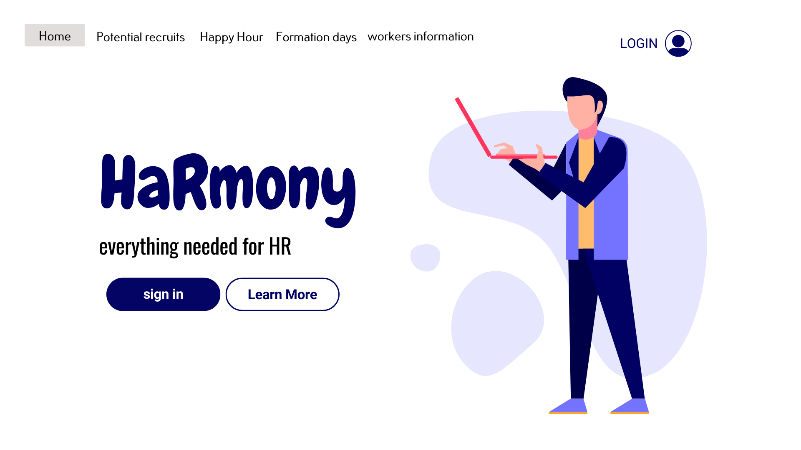
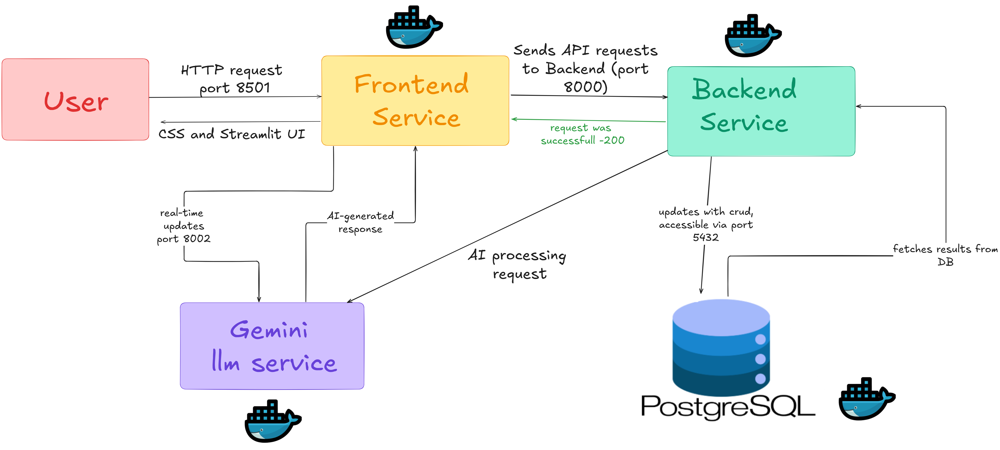

# **HaRmony**
## Human Resources Management Interface System

  

## 📝 Overview
HaRmony is a web-based **Human Resources Management System** that enables companies (specifically HR teams) to efficiently manage employees, potential recruits, events, and team-building activities. The system is built on **microservices architecture** and 
The system is composed of **four microservices**: 

- **🖥 Backend**: Built with **FastAPI**, handling all server-side logic and database interactions. 
-  **🎨 Frontend**: Developed using **Streamlit**, providing an intuitive and dynamic UI. 
 -  **🐘 Database**: Powered by **PostgreSQL**, ensuring reliable data storage and management. 
  -  **🤖 Gemini AI**: A Google-powered **LLM microservice** for HR-related AI assistance.

---
### **🛠️ Diagram Explanation:** 

  

- *User* interacts with the system through the *Frontend Service* (port 8501), which provides a Streamlit UI. 
-  The *Frontend Service* communicates with the *Backend Service* (port 8000) to send and receive data. 
- The *Backend Service* manages CRUD operations and updates the *PostgreSQL Database* (port 5432). 
-  The *Gemini LLM Microservice* (port 8002) provides AI-powered assistance, interacting with both the Frontend and Backend for AI-related tasks. 
-  All services are Dockerized 🐳 for seamless deployment and scalability.

---

## Technologies Used

### 🖥️ Backend:

-   **Python 3.10+**
-   **FastAPI** – A modern and fast web framework for building APIs.
-   **SQLAlchemy** – ORM for database management.
-   **PostgreSQL** – Relational database.
-   **CORS Middleware** – To enable frontend-backend communication.

### 🎨 Frontend:

-   **Streamlit** – A Python-based web application framework for an interactive interface.

### 🗄️ Database:

-   **PostgreSQL** – A powerful open-source relational database.

### 🐳 Containerization:

-   **Docker** – For creating isolated containers for the backend, frontend, and database.
-   **Docker Compose** – To orchestrate multi-container services.
---

## 🚀 Features 
### **Employee Management**
✅ View, search, and update employee records
✅ Upload employee profile pictures 
✅ Organize employees by department 
  ### **Recruitment & Candidate Management** 
✅ Store potential recruits' information 
✅ Upload and download candidate resumes 
✅ Search for recruits based on keywords 
✅ Add and Remove potential recruits cards
  ### **Company Events & Team Building**
✅ Create and manage Happy Hour events 
✅ Organize Formation Days with predefined locations 
✅ Raffle employees for event participation
   ### **AI-Powered HR Assistance**
✅ Get HR-related AI recommendations via the *Gemini AI microservice*
✅ Assist employees in HR queries with natural language processing.

## 🎥 Demo

---

## 🗂️ Project Structure

    ├── README.md
    ├── backend
    │   ├── Dockerfile
    │   ├── app
    │   │   ├── __init__.py
    │   │   ├── crud.py
    │   │   ├── database.py
    │   │   ├── main.py
    │   │   ├── models.py
    │   │   ├── routes
    │   │   │   ├── __init__.py
    │   │   │   ├── employees.py
    │   │   │   ├── formation_events.py
    │   │   │   ├── happy_hour.py
    │   │   │   ├── login.py
    │   │   │   ├── potential_recruits.py
    │   │   │   └── register.py
    │   │   └── schemas.py
    │   ├── requirements.txt
    │   ├── scripts
    │   │   └── dump_db.sh
    │   ├── tests
    │   │   ├── __init__.py
    │   │   ├── script.py
    │   │   └── test_routes.py
    │   └── uploads
    │       └── resumes
    │           ├── 1.pdf
    ├── backup.sql
    ├── db_backup.sql
    ├── docker-compose.yml
    ├── frontend
    │   ├── Dockerfile
    │   ├── assets
    │   │   ├── AiAssistTitle.gif
    │   │   ├── HaRmonyLogo.png
    │   │   ├── WorkerPageTitle.png
    │   │   ├── balloon.png
    │   │   ├── fonts
    │   │   │   └── Handmade Valentine.otf
    │   │   ├── formationdaystitle.png
    │   │   ├── homepagemanvector.jpg
    │   │   ├── recruitsphotos
    │   │   ├── registerpagevector.jpg
    │   │   ├── search_icon.png
    │   │   └── usernamedisplay.png
    │   ├── home.py
    │   ├── package-lock.json
    │   ├── package.json
    │   ├── pages
    │   │   ├── AI_assist.py
    │   │   ├── formation_days.py
    │   │   ├── happy_hour.py
    │   │   ├── login.py
    │   │   ├── potential_recruits.py
    │   │   ├── register.py
    │   │   └── workers_information.py
    │   └── requirements.txt
    └── gemini_service
        ├── Dockerfile
        ├── __pycache__
        │   ├── gemini_client.cpython-310.pyc
        │   └── main.cpython-310.pyc
        ├── app
        │   ├── __init__.py
        │   ├── __pycache__
        │   │   ├── __init__.cpython-310.pyc
        │   │   ├── gemini_client.cpython-310.pyc
        │   │   ├── main.cpython-310.pyc
        │   │   ├── prompt_templates.cpython-310.pyc
        │   │   └── settings.cpython-310.pyc
        │   ├── gemini_client.py
        │   ├── main.py
        │   ├── prompt_templates.py
        │   └── settings.py
        ├── config
        └── requirements.txt

---

## 🏗️ **Setting up the Project**
Clone the repository:

    git clone https://github.com/EASS-HIT-PART-A-2024-CLASS-VI/HaRmony---HR-management-system-Or-Dorbin.git
    cd HaRmony---HR-management-system-Or-Dorbin

### 🔑 **Setting Up the .env File**

To enable **Google Gemini AI**, you must create an API key from [Google AI Studio](https://aistudio.google.com/app/apikey).

Then, create a `.env` file in the root directory and fill it with:

    GEMINI_API_KEY=<YOUR_API_KEY>'

Ensure `.env` is **excluded from version control** by adding it to `.gitignore`.

## 🐳 Docker Deployment

HaRmony is fully containerized with **Docker Compose**.
To deploy all services, run:

`docker-compose up --build` 

This will start **all microservices** (Backend, Frontend, Database, and AI Service).

Once running:

-   **Frontend**: [http://localhost:8501](http://localhost:8501)
-   **Backend API Docs**: [http://localhost:8000/docs](http://localhost:8000/docs)
-   **LLM Microservice**: http://localhost:8002

## ⚡ **Backend API**

The **FastAPI backend** provides a **fully RESTful API**, accessible via Swagger UI: 📌 **[http://localhost:8000/docs](http://localhost:8000/docs)**

The **FastAPI** backend handles:

-   **Employee and recruit management**
-   **Event scheduling**
-   **Authentication**
-   **AI chatbot integration**
-   **Resume upload/download**

### 📌 **API Endpoints**

### **Employee Management API**

-   **`GET /employees/`** - Retrieve all employees
-   **`GET /employees/search/`** - Search for employees
-   **`GET /employees/birthdays/`** - View upcoming birthdays
-   **`POST /employees/upload-image/`** - Upload employee images
-   **`GET /employees/departments/`** - Retrieve all departments

### **Recruitment API**

-   **`POST /potential_recruits/`** - Create a new recruit
-   **`GET /potential_recruits/`** - Retrieve all potential recruits
-   **`GET /potential_recruits/search/`** - Search for recruits
-   **`DELETE /potential_recruits/{id}`** - Remove a recruit
-   **`POST /potential_recruits/{id}/upload_resume/`** - Upload a recruit’s resume
-   **`GET /potential_recruits/{id}/download_resume/`** - Download a resume

### **Event & Team Building API**
-   **`POST /formation_events/create_event/`** - Create an event
-   **`GET /formation_events/upcoming/`** - View upcoming events
-   **`GET /formation_events/past/`** - View past events
-   **`POST /happy_hour/event/`** - Create a Happy Hour event
-  **`GET /happy_hour/events/all`** - Get all upcoming events 
- **`POST /happy_hour/draw`**- draw selected number of employees for different activities

### **Authentication API**
-   **`POST /auth/register/`** - Register a new user
-   **`POST /auth/login/`** - Authenticate user credentials

#### 🧪 **Running Backend Tests**

    docker exec -it harmony-backend /bin/bash
    pytest tests/
Tests run in **a separate test database** without affecting production data.

## 🎨 **Frontend**

The Streamlit UI provides a modern, interactive HR experience.
### ✨ **Features**
-   🎈 **Birthday balloons for employees celebrating this month**
-   📂 **Resume upload & retrieval for recruits**
-    📂 **Persistent session state for logged-in users**
-   🎨 **Enhanced UI with custom CSS & animations**
-   🔎 **Persistent search bar & filter options**
- 🤖  **Live AI Chat Assistant**

## 🗄️ **Database**

HaRmony uses **PostgreSQL** as its database, with the following tables:

-   **employees**
-   **users**
-   **formation_events**
-   **happy_hour_events**
-   **potential_recruits**
-   **approved_places**

Database is automatically set up within the **Docker container**.

CRUD operations are managed in `crud.py` and `schemas.py`.

## 🤖 **Gemini AI Microservice**

The **LLM-powered AI assistant** enhances HR operations by providing **real-time HR-related suggestions**.

### **Endpoints**

-   **`GET /`** - Health check
-   **`POST /chat`** - Ask an HR-related question

>📌 **Important:**  
> The AI **only answers HR-related questions** (defined in `prompt_templates.py`).

### 🎉 **Get Started Today!**

Deploy **HaRmony** with **Docker** and start managing HR tasks seamlessly! 🚀

  

## Contact Info

  

-  **Project Author:** Or Dorbin

-  **Email:** ordorbin13@gmail.com

-  **GitHub:** [Or Dorbin](https://github.com/Ordorbin)